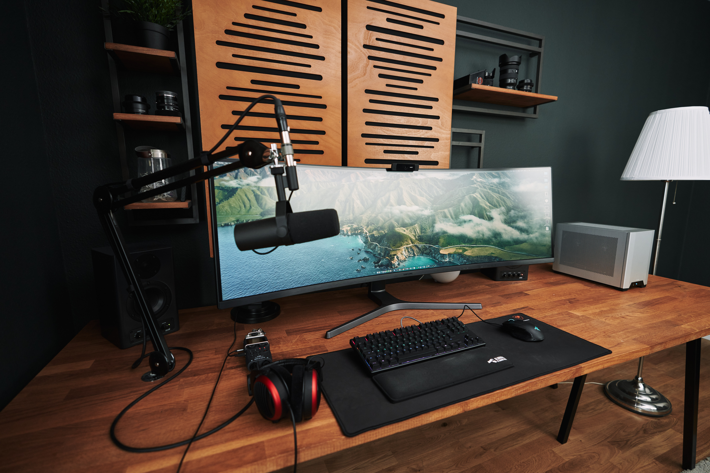
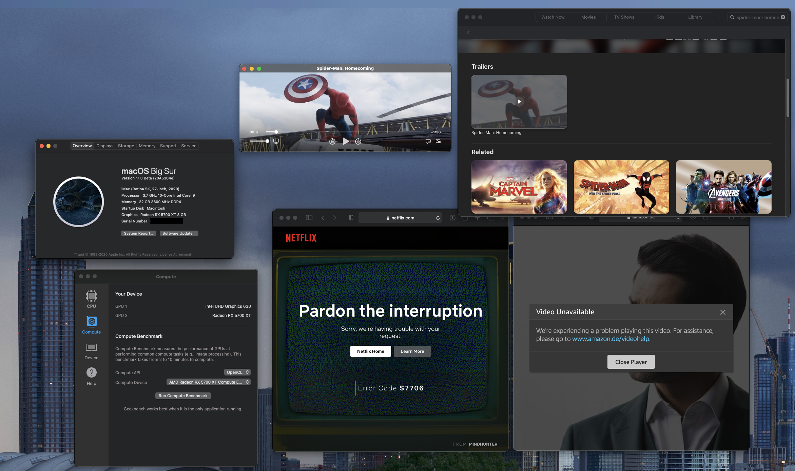
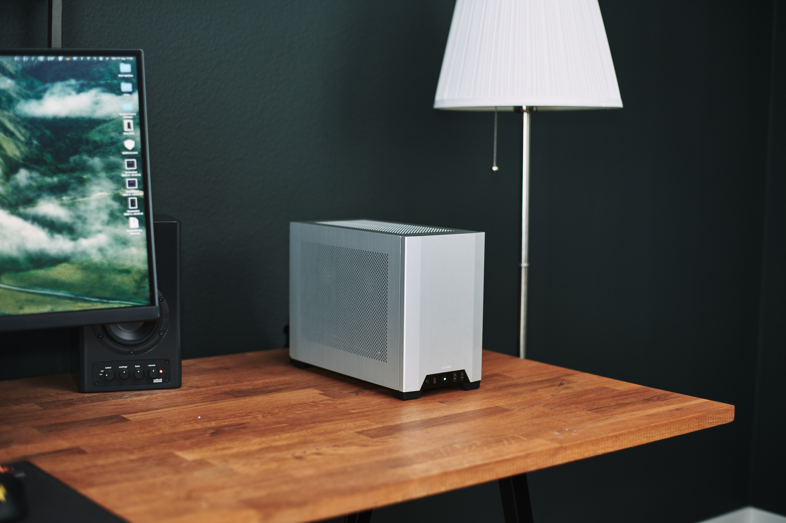
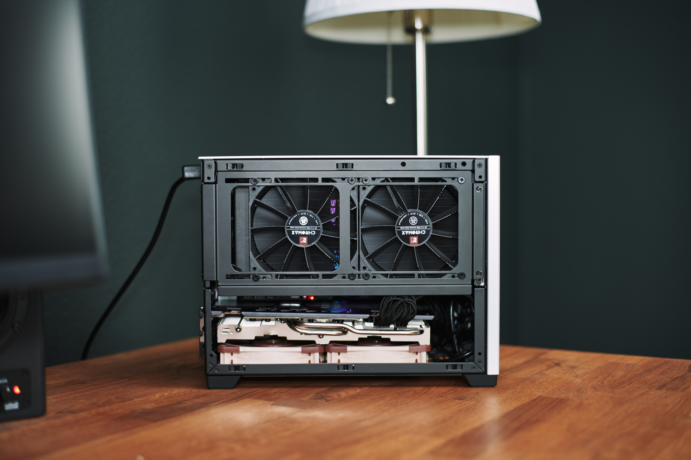
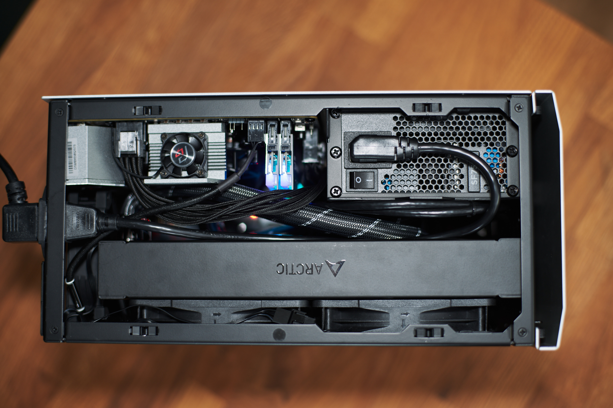
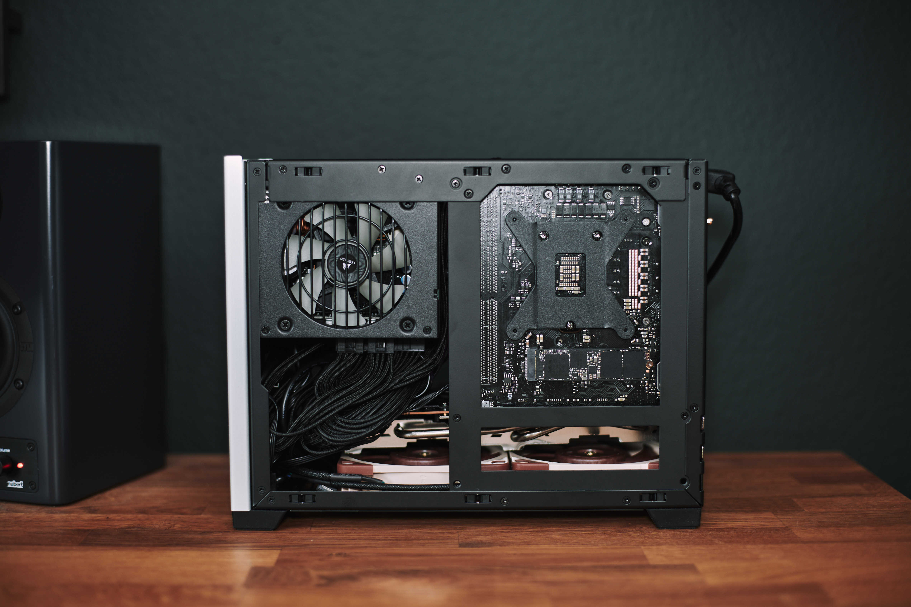

# Hackintosh-Intel-i9-10900k-AsRock-Z490-Phantom-ITX-TB3



Hello folks,

This is the repository of my newest ITX-build based on the AsRock Z490 Phantom Gaming ITX/TB3.

You can find my EFI folder in this repository.

**Current Bootloader: OpenCore 0.6.3**


# Hardware
- Intel i9-10900k
- AsRock Z490 Phantom Gaming ITX/TB3:
	- Audio: Realtek ALC1220-VB
	- 2.5Gbit Ethernet: Realtek RTL8125B-CG (requires LucyRTL8125Ethernet.kext)
	- 1x USB-C, there is no USB-C Header for an additional Front USBC
  - 1x Thunderbolt 3 ports
- RAM: 32GB G.Skill Trident Z 3600Mhz CL18
- GPU: Saphire Pulse 5700 XT
- Wifi/BT: Intel AX201, replaced by a Broadcom BCM94360NG for macOS Compatibilty. Works out of the box. The BCM94360NG fits into the original WiFi-card housing and sits under the IO-shield. Original antennas fit.
- Case: NCASE M1 v6.1

# Working
- [x] **Tested with macOS Catalina (requires 10.5.7) and macOS Big Sur**
- [x] **Wifi and Bluetooth** (via BCM94360NG Wireless Card).
- [x] **Audio**: Realtek ALC1220-VB (requires AppleALC.kext, layout-id=11, FakeID.kext, FakePCIID_Intel_HDMI_Audio.kext)
- [x] **USB**, all ports 
- [x] **Thunderbolt 3** including Hot-plug
- [x] **2.5Gbit Ethernet: Realtek RTL8125B-CG** (requires LucyRTL8125Ethernet.kext)
- [x] **With iMacPro1,1: Amazon Prime Video and Netflix in Safari. AppleTV.**
- [x] **With iMac20,2: SideCar and AppleTV, but no Amazon Prime Video and Netflix in Safari.** But Amazon Prime and Netflix works with other browsers like Chrome, Firefox or Edge.
- [x] **Sleep/Wake**
- [x] **Shutdown**
- [x] **Restart**

# Not working
- with iMacPro1,1: No SideCar.
- with iMac20,2: Currently no Amazon Prime Video and Netflix playback in Safari. But Amazon Prime and Netflix works with other browsers like Chrome, Firefox or Edge.

# more images








# Details

## Installation steps

1. Create an MacOS Catalina 10.15.6 USB-Installer Stick. Do this on a real Mac.
	- Go into the app store and search for Catalina. Download it. It should download to your Macs application folder.
	- Plugin a plain vanilla USB-Stick with at least 16GB. My installation needed 8.24GB.
	- The following assumes your USB stick is called "MyVolume".
	- Check that "MyVolume" is partitioned with GUID. [Technical Note: GUID Format](/Docs/TechnicalNotes.md/#technical-note-installation--guid-format)
	- Open the terminal and enter this command to create the installer (Replace "MyVolume" with your USB-sticks name. In this case Untitled: ```sudo /Applications/Install\ macOS\ Catalina.app/Contents/Resources/createinstallmedia --volume /Volumes/MyVolume```
	- Now there should be a progress bar in the terminal showing the creation process in %. Wait until it is complete.
	- At the end your USB-stick should be named "Install macOS Catalina".

2. Mount the EFI-partition of the "Install macOS Catalina" disk.
	- I use Hackintool for this.
	- Open Hackintool and go to the "Disks" menu. There you should see your disks.
	- Press the double-arrow in the 6th column on the USB disk to mount the EFI-partition of your installer disk.
	
	
3. Delete all folders and then copy my entire EFI folder to the root of the EFI-partition
4. Decide for yourself if you want to use the iMac20,2 (EFI/OC/config_iMac20,2_5700XT.plist) or iMacPro1,1 (EFI/OC/config_iMacPro1,1_5700XT.plist). If you don't need SideCar and want to watch Amazon Prime or Netflix in Safari, you should use the iMacPro1,1 config. For everyone else I would recommend the iMac20,2 as this is closer to the real Mac. Rename the config of your choice to ```config.plist```. If you don't rename one and there is no ```config.plist``` it won't work!
5. Go to EFI/OC and open the config.plist with a plist Editor (I use "PLIST Editor" from the app store but other alternatives are [XCode](https://developer.apple.com/support/xcode/) or [ProperTree](https://github.com/corpnewt/ProperTree))
6. Within the config.plist navigate to PlatformInfo/Generic and paste your serials for MLB, SystemSerialNumber and SystemUUID. You can generate them with the tool CloverConfigurator. [Technical Note: Serial Numbers](/Docs/TechnicalNotes.md/#technical-note-installation--serial-numbers)
7. Make a backup of this altered EFI folder which includes your unique serial number changes.
8. Adjust your BIOS-Settings. See [My BIOS-settings](/Docs/BIOS-settings/bios-settings.md) for reference.
9. Reboot from the installation media and install macOS. The installation needs Internet. So either install a supported WiFi-card or plugin Ethernet.

If you get an error within the installation saying something like "this installation is damaged" you can try this workaround: 
 Delete Installinfo.plist on the installer disk:
  - Open the "Install macOS Catalina" Disk
  - Right Click on the package "Install macOS Catalina"
  - Click on "Package Contents"
  - Then navigate to Contents > SharedSupport
  - Delete the Installlnfo.plist

## Post Istall

Once you have installed MacOS Catalina onto your hackintosh's drive you should repeat the same steps above of installing the EFI folder onto it's EFI-partition:

  - (Don't have two EFI partitions mounted at the same time since it can confuse things)
  - Mount the EFI-partition of your hackintosh's drive (ie of the drive you installed Catalina onto)
  - Replace the entire contents of this EFI-partition with the your specialized entire EFI folder (which includes your own unique serial numbers)

Now your hackintosh can boot without the USB install stick.

Then following the other sections below you might want to investigate a GUI boot menu, a boot chime, and other post install niceties. (See [dortania post install cosmetics](https://dortania.github.io/OpenCore-Post-Install/cosmetic/gui.html#opencore-beauty-treatment))

## Fixing Sleep/Wake 

In this section I want to show you how I setup my system so it sleeps and wakes just fine, but I don't tell you that you need exactly these settings to have a proper configuration.

At first, I set the following settings in Hackintool. You can edit them by clicking on the value, but it has a very small "clickable" area:


### Energy Saver Settings ###


### Bluetooth Settings ###


## USB

I use USBInjectAll.kext and created my own SSDT-EC-USBX.aml and SSDT-UIAC.aml using Hackintool. If you have a different board, you should create your own USB-port configuration and shouldn't use someone elses SSDT-EC-USBX.aml and SSDT-UIAC.aml.

For more details on the process itself, see the explanation I have made for my previous Gigabyte Z490 Vision D built:  [USB port configuration Gigabyte Z490 Vision D](https://github.com/SchmockLord/Hackintosh-Intel-i9-10900k-Gigabyte-Z490-Vision-D/blob/master/USB-Port-Configuration.md)


## Audio

I needed this to get Audio working:
- AppleALC.kext
- FakeID.kext
- FakePCIID_Intel_HDMI_Audio.kext
- layout-id=11
- ~device-id=0xA170~

The layout-id and the device-id is injected via the device properties.

The audio device has the PCI-Address PciRoot(0x0)/Pci(0x1F,0x3).
```
	<key>PciRoot(0x0)/Pci(0x1F,0x3)</key>
	<dict>
		<key>layout-id</key>
		<data>CwAAAA==</data>
	</dict>
```

## 2.5Gbit Ethernet: Realtek RTL8125B-CG (requires LucyRTL8125Ethernet.kext)

Simply add the newest LucyRTL8125Ethernet.kext.

## Wifi/Bluetooth
You need natively supported Wifi and Bluetooth to use Airdrop, Unlock with Apple Watch etc.

I have replaced the onboard Intel AX201 with a BCM94360NG. It sits in a small metal housing under the IO-shield. By removing the screws from the IO-shield, you can simply unplug the housing and replace the AX201 with the BCM94360NG. The original antennas fit onto the BCM94360NG.

## Thunderbolt 3 Support

In your BIOS set the following settings. You also need the SSDT-TB3HP.aml in EFI/OC/ACPI to enable Thunderbolt Hotplug support.


# Credits
Thanks for your support :) Your help was crucial for my build.
- the german hackintosh-community at hackintosh-forum.de: Especially dsm2, CMMChris, brumbaer, JimSalabim
- https://github.com/daliansky/XiaoXinPro-13-hackintosh: This repository inspired my first config and gave me the CPU-FakeID. Thank you for that :)
- [Dortania](https://github.com/dortania) for this great OpenCore Desktop Guide
- [headkaze](https://github.com/headkaze) for Hackintool and our productive conversations :)
- [Acidanthera](https://github.com/acidanthera) for too many things to mention each
- [RehabMan](https://github.com/RehabMan) for too many things to mention each
- [OpenCore project](https://github.com/OpenCorePkg) for this great bootloader

Best,
Chris 
aka SchmockLord
